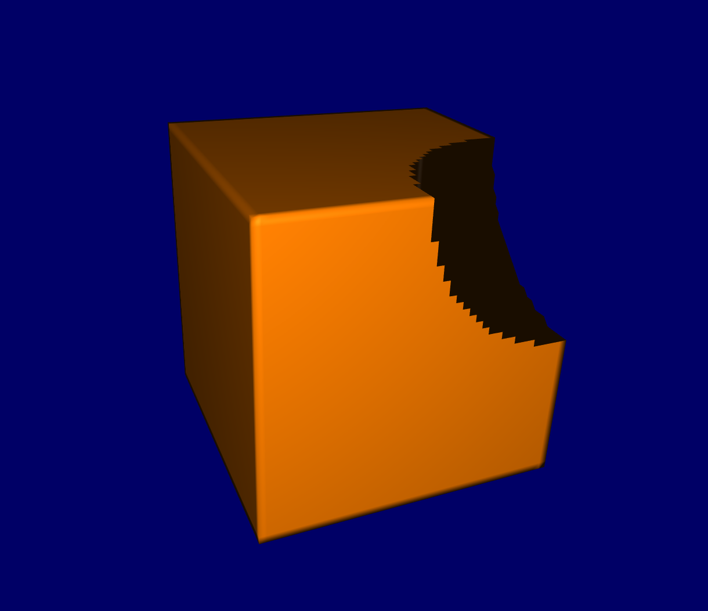

# COMP 371 Project - OpenGL CSG

### *Owen Hellum*

## What is Constructive Solid Geometry?

Constructive Solid Geometry (*aka* CSG) (*aka* boolean operations) is a technique used in 3D modelling to quickly generate complex models using only a few simple primitives. The technique is a mainstay in workflows for hard surface modelling, and plugins for it exist in many pre-existing 3D softwares.

The most common CSG operations that are used are **union**, **subtraction**, **intersection**, and **difference**. These are similar to boolean operations performed on, for example, mathematical sets, but in this case are applied to 3D objects.

## Project objectives and milestones

The main goal of the project was to emulate these CSG operations on arbitrary objects using OpenGL. Secondary objectives like generating OBJ files of the resulting geometry and reading custom inputs were also included. Nearly all goals were accomplished, with some even taken beyond their initial goal. The following was a timeline of development:

1. Calculating when points are inside of meshes
2. Removing unnecessary vertices
3. Defining the 4 operations
4. Generating scenes from JSON files
5. Saving resulting geometry to OBJ files

[Click here to download the example JSON above](cube_and_sphere.json)

[Click here to download the example OBJ generated above](cube_subtract_sphere.obj)

## JSON input

**For geometry:**

- `name`: String name of the object (to be used in the operation later on)
- `filename`: String name of the OBJ file to be read from for this object (minus the folder path and `.obj` extension)
- `scale`: Float value to resize the object by
- `offset`: 3D vector to reposition the object by
- `colour`: The RGB colour of the object when shown
- `show`: Whether to show the original object in the 3D scene

**For operations:**

- `name`: String name of the operation (used when generating the resulting OBJ)
- `model1`: String name of the model to have the operation performed on
- `model2`: String name of the model to perform the operation with
- `operation`: String for type of operation to perform (`+` = union, `-` = subtraction, `|` = intersection, and `\` = difference)
- `colour`: The RGB colour of the operation when it generates
- `save`: Whether to save the resulting geometry to a new OBJ file

## Image gallery

